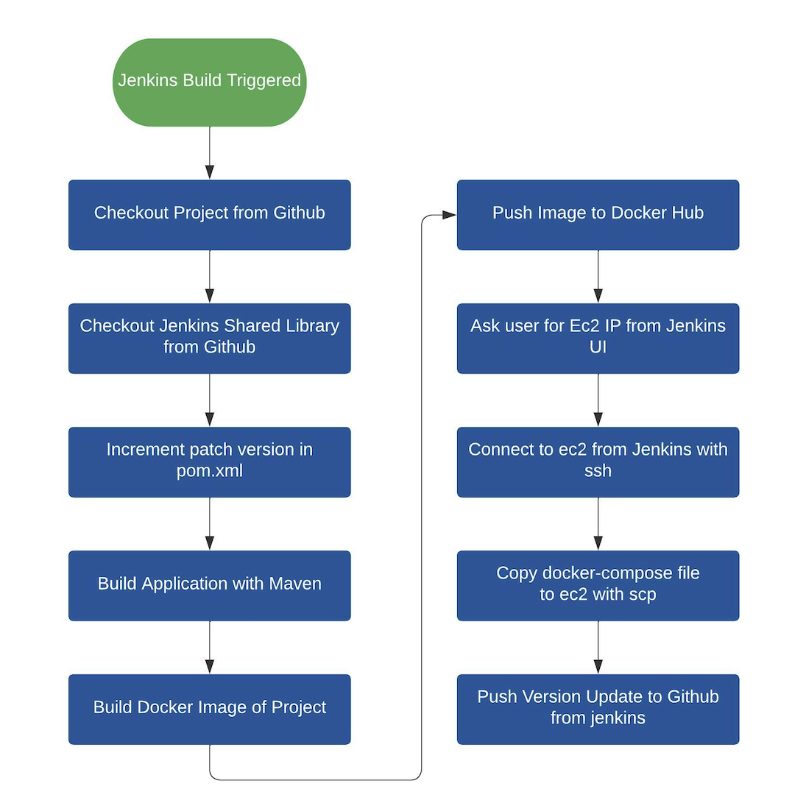
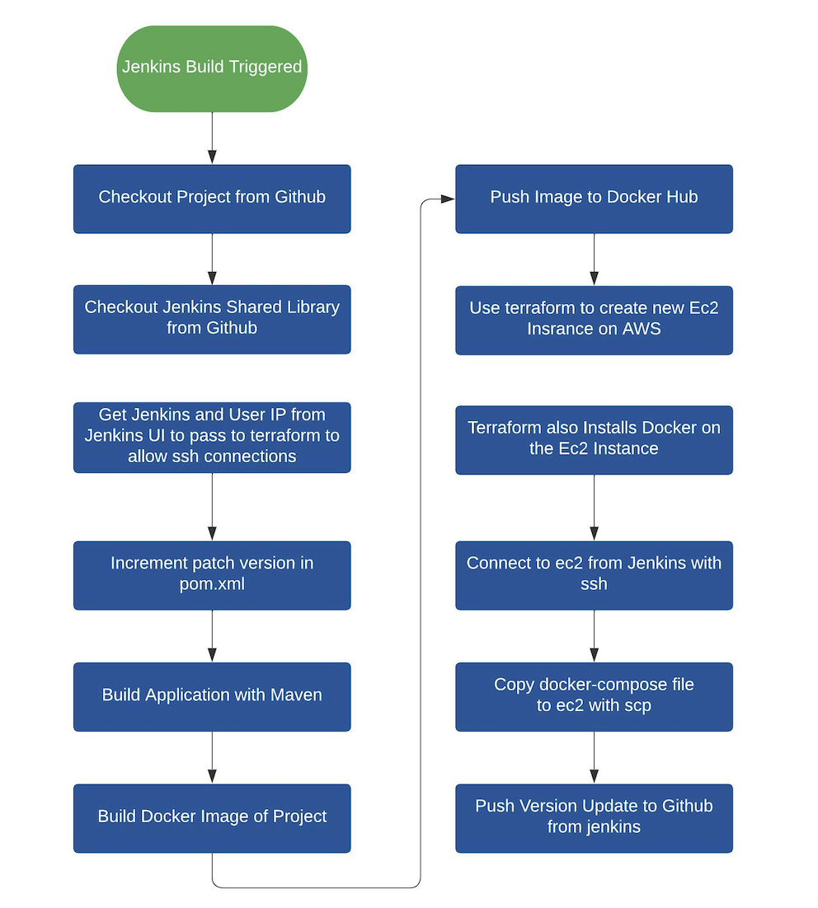

# !! Greetings 🤓

First of all, thank you for taking an interest in my resume and projects.

This page will direct you to different projects in my Github profile. If you get lost please return to this page :D

It is a work in progress, so you may see some things added/refined in the future.

---

### Table of Contents 📚

#### Ci/Cd Projects 🚀
- [Ci/Cd Project 1](#cicd-project-1)
- [Ci/Cd Project 2](#cicd-project-2)

#### Infrastructure as Code Projects 🛠️
- [IaC Project 1](#iac-project-1)
- [IaC Project 2](#iac-project-2)

#### Guides and Notes ⚙️
- [Guide 1](#guide-1)
- [Guide 2](#guide-2)

---

## Ci/Cd Project 1 
#### Deploy to existing AWS Ec2 server from Jenkins

Source Code of the project

https://github.com/yigitcicek/sample-app-spring-boot-hello/tree/feature/docker-compose-ci-cd

###### ! Pay attention to branches, different branches have different functionalities

Diagram of the project

---

## Ci/Cd Project 2 
#### Create New Ec2 with Terraform Install Docker in it and Deploy the project there using Jenkins

Source Code of the project

https://github.com/yigitcicek/sample-app-spring-boot-hello/tree/feature/terraform-ec2-docker-compose

###### ! Pay attention to branches, different branches have different functionalities

Diagram of the project

---

## IaC Project 1 
#### Create an Ec2 instance and install docker with Terraform

Source Code of the project

https://github.com/yigitcicek/terraform-sample-ec2-docker/tree/feature/modular-version

---

## IaC Project 2 
#### Create a 2 Worker Node EKS Cluster with Terraform

Source Code of the project

https://github.com/yigitcicek/terraform-sample-eks/tree/feature/automate-eks-provision

---

## Guide 1 
#### Install Jenkins with Docker inside using host Docker socket

Source Code of the project

https://github.com/yigitcicek/free-flowing-devops/tree/main/ci-cd/jenkins/jenkins-docker-compose-socket

---

## Guide 2 
#### Install Jenkins with Docker inside using Docker Dind image

Source Code of the project

https://github.com/yigitcicek/free-flowing-devops/tree/main/ci-cd/jenkins/jenkins-docker-compose-dind
